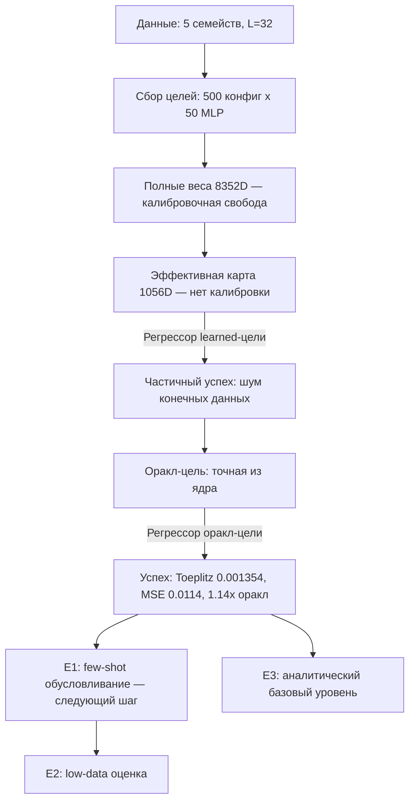

# Техническое задание: детерминированный регрессор эффективной карты (config → effective map → MLP)

> **Статус документа:** пересмотрен по итогам завершённых экспериментов. Документ описывает текущее состояние проекта — пайплайн детерминированного регрессора эффективной карты — и является источником истины.

---

## 0. Краткое резюме и главный научный вывод

### 0.1 Исходная задача
Одномерные регрессионные наборы данных, истинное правило которых — локальный, трансляционно-эквивариантный фильтр (свёртка). Свёртка кодирует это правило точно и с малым числом параметров. Требуется построить модель, которая по **конфигурации набора данных** (семейство, ядро, радиус, шум) воспроизводит **эффективную линейную карту** `M @ x + b_eff` и, через SVD-факторизацию, веса MLP, реализующие свёрткоподобное отображение.

### 0.2 Главный вывод по итогам завершённой работы

1. **Обусловливание ядром + детерминированный регрессор — достаточно и валидировано.** Детерминированный регрессор `config[14] → effective_map[1056]`, обученный на точных оракл-целях, восстанавливает свёрточную структуру на отложенных конфигурациях с функциональным MSE ≈ 1.14× от оракл-свёртки. Это подтверждает корректность всего пайплайна (данные → цель → модель → оценка).

2. **Поскольку ядро подаётся напрямую, этот базовый уровень валидирует пайплайн, но НЕ демонстрирует выученное индуктивное смещение из данных.** Оракл-регрессор — это потолок пайплайна при обусловливании подаваемым ядром, а не доказательство выученного индуктивного смещения.

3. Следующий логичный шаг — заменить прямое обусловливание ядром на **few-shot обусловливание** парами поддержки `(x_i, y_i)` (см. Часть II, E1), чтобы проверить, может ли мета-модель вывести свёрточную структуру из данных.

---

# ЧАСТЬ I. ЗАВЕРШЁННАЯ РАБОТА И РЕЗУЛЬТАТЫ

## 1. Модуль генерации одномерных данных

### 1.1 Что делает набор данных «легко решаемым свёрткой, но не MLP с нуля»
Одномерный регрессионный набор $D = \{(x_i, y_i)\}$, где $y = f(x)$ и $f$ — **локальное, трансляционно-эквивариантное** отображение: выход в позиции $p$ зависит только от окна $x_{p-r}, \dots, x_{p+r}$ через фиксированное ядро $k$. Свёртки кодируют это в точности (совместное использование весов + локальность). Несвязанный MLP *может* подогнать его (ёмкость), но при ограниченном числе выборок склонен выучивать нелокальное, привязанное к позиции отображение.

### 1.2 Длина сигнала и соглашение о свёртке
- **Длина входа** $L = 32$ (фиксировано). Каждая выборка $x \in \mathbb{R}^{L}$.
- **Радиус ядра** $r \in \{1, 2, 3\}$ → размер ядра $K = 2r+1 \in \{3, 5, 7\}$.
- **Режим свёртки**: `same` (длина выхода = $L$), zero-padding. Реализация: [`conv1d_same()`](src/data/dataset.py:1) в [`src/data/dataset.py`](src/data/dataset.py:1).
- Выход: $y_p = \sum_{j=-r}^{r} k_j \, x_{p+j}$ с zero-padding на границах.

### 1.3 Семейства наборов данных
Пять 1D FIR-семейств:

| Префикс ID | Семейство | Генерация ядра | Почему удобно для свёртки / сложно для MLP |
|-----------|--------|-------------------|------------------------------|
| `MA` | Скользящее среднее (low-pass) | box / Гаусс, нормированный к сумме 1 | Локальное сглаживание; MLP переобучается на высокочастотном шуме |
| `DIFF` | Разностный / детектор границ | $[-1, 0, 1]$, Sobel-подобный | Локальная производная; привязанный к позиции MLP не справляется со сдвинутыми границами |
| `GAUSS` | Гауссово размытие | $k_j \propto \exp(-j^2/(2\sigma_k^2))$ | Локальное сглаживание с переменной шириной |
| `MATCH` | Локальное сопоставление шаблонов | Разреженное ядро (сдвиг, 2-я разность) | Обнаруживает конкретный локальный мотив |
| `RAND` | Случайный локальный FIR | $k \sim \mathcal{N}(0, I_K)$ | Общий локальный линейный фильтр; проверяет мета-обобщение |

Реализация: [`src/data/families.py`](src/data/families.py:1).

### 1.4 Параметризация и схема ID
Экземпляр задаётся кортежем параметров; **dataset ID** = `SHA1(canonical_json(DatasetConfig))[:16]`. Реестр: [`src/data/registry.py`](src/data/registry.py:1).

```
DatasetConfig:
  family:        str   in {MA, DIFF, GAUSS, MATCH, RAND}
  kernel:        float32[K]
  radius:        int   in {1,2,3}
  noise_std:     float in {0.0, 0.05, 0.1, 0.2}
  n_train:       int
  n_test:        int   = 512
  seed:          int
  L:             int   = 32
```

### 1.5 Сбор целей: фактический масштаб
- **500 конфигураций наборов данных × 50 MLP = 25 000 целей** собрано.
- Каждый MLP использует `n_train=1024` и обобщается на уровне шумового дна.
- Полные веса MLP (8352D) имеют **калибровочную свободу** (gauge freedom): бесконечно много факторизаций `(W1, W2)` дают одну и ту же функцию.

---

## 2. Архитектура MLP и эффективная карта

### 2.1 Архитектура MLP
`MLPConv`: `Linear(L, H) → Linear(H, L)`, **линейный** (без активации), $L=32$, $H=128$.
- Ёмкость: $H(L+1) + L(H+1) = 128\cdot33 + 32\cdot129 = 4224 + 4128 = 8352$ параметров.
- Свёртке нужно лишь $K \le 7$ параметров → ёмкость не является узким местом; индуктивное смещение — да.
- Реализация: [`src/models/mlp.py`](src/models/mlp.py:1); кодек: [`src/models/weight_codec.py`](src/models/weight_codec.py:1).

### 2.2 Эффективная карта (Стратегия B) — устранение калибровочной свободы
Поскольку MLP линеен, $y = W_2(W_1 x + b_1) + b_2 = (W_2 W_1)x + (W_2 b_1 + b_2) = M x + b_{\text{eff}}$.

- **Эффективная матрица** $M = W_2 W_1$, форма $[L, L] = [32, 32]$ → 1024 значений.
- **Эффективный bias** $b_{\text{eff}} = W_2 b_1 + b_2$, форма $[L] = [32]$ → 32 значения.
- **Итоговая размерность эффективной карты: 1056** (без калибровочной свободы).

Все 50 MLP на конфигурацию вычисляют одну и ту же функцию → одну и ту же $(M, b_{\text{eff}})$ → целевое распределение — плотный кластер.

Макет эффективной карты (фиксированный):
```
eff_map = concat([flatten(M), flatten(b_eff)])   # 1024 + 32 = 1056
```
Реализация: [`src/models/effective_map.py`](src/models/effective_map.py:1).

### 2.3 SVD-факторизация: эффективная карта → веса MLP
Детерминированное обратное преобразование через SVD (см. [`effective_map_to_weights()`](src/models/effective_map.py:112)):
$$M = U\,\text{diag}(S)\,V^T, \quad W_1 = \text{diag}(\sqrt{S})\,V^T, \quad W_2 = U\,\text{diag}(\sqrt{S})$$
(с clamp сингулярных значений к малому полу для численной устойчивости). Это убирает калибровочную свободу при инстанцировании MLP из предсказанной карты.

### 2.4 Оракл-цель (точная)
Точная оракл-эффективная карта строится **напрямую из известного ядра** и фактического соглашения репозитория `conv1d_same` (см. [`kernel_to_oracle_matrix()`](src/models/oracle_map.py:59)):
$$M[p, q] = k[q - p + r] \quad \text{при } 0 \le q - p + r < K, \text{ иначе } 0; \quad b_{\text{eff}} = 0.$$
Это **MLP-соглашение** (транспонированное к матрице оператора свёртки), так что $M @ x = \text{conv1d\_same}(x, k)$.

**Валидация оракл-карты:**
- Прямое $M @ x$ vs `conv1d_same`: максимальная ошибка **9.5e-07**.
- SVD-MLP vs `conv1d_same`: максимальная ошибка **9.4e-06**.

Реализация: [`src/models/oracle_map.py`](src/models/oracle_map.py:1); self-check при импорте: [`_self_check()`](src/models/oracle_map.py:164).

---

## 3. Детерминированный регрессор эффективных карт

### 3.1 Назначение
Контролируемый базовый уровень: отображает 14-мерный вектор признаков конфигурации напрямую в 1056-мерную эффективную карту. Изолирует, корректен ли пайплайн конфигурация/цель: если этот простой детерминированный регрессор выучивает отложенные эффективные карты и даёт свёрточные функциональные выходы, то пайплайн корректен.

Реализация: [`src/models/effective_map_regressor.py`](src/models/effective_map_regressor.py:1); обучение: [`src/training/train_effective_map_regressor.py`](src/training/train_effective_map_regressor.py:1).

### 3.2 Архитектура
`14 → 256 → 512 → 512 → 1056`, GELU, residual-соединение через два 512-широких скрытых слоя, LayerNorm (pre-norm). **1 205 024 параметра.**

### 3.3 Режимы цели
- **`"learned"`**: среднее 50 эффективных карт MLP на конфигурацию (содержит шум конечной выборки).
- **`"oracle"`**: точная карта из известного ядра через [`kernel_to_oracle_effective_map()`](src/models/oracle_map.py:93) (детерминированная, бесшумная).

### 3.4 Разбиение
Детерминированный разбор по конфигурациям: `np.random.default_rng(seed)` с `val_configs` hold-out конфигами (по умолчанию 450/50). `WeightNormalizer` обучается только на train-целях; обучение — в нормализованном пространстве.

---

## 4. Валидированный базовый уровень оракл-регрессора (главный результат)

### 4.1 Метрики на отложенных конфигурациях (val)

> Использовать эти точные значения, если артефакт не указывает иное. Источник: [`results/regressor_oracle/evaluation/summary.json`](results/regressor_oracle/evaluation/summary.json).

| Метрика | Значение (val) | Контекст |
|----------|---------------|---------|
| Нормализованная map MSE | 1.62e-04 | регрессор vs оракл-цель, норм. пространство |
| Сырая eff-map MSE | 4.2e-05 | регрессор vs оракл-цель, сырое пространство |
| Toeplitz-оценка (предсказанная) | 0.001354 | vs оракл ~0, learned-target MLP 0.00294 |
| Kernel cosine similarity | 0.99994 | восстановленное ядро vs истинное |
| Kernel L2 distance | 0.0120 | восстановленное ядро vs истинное |
| Функциональный MSE (оракл-регрессор) | 0.011434 | vs оракл-свёртка 0.009995 → **1.14×** |

### 4.2 Валидация точной оракл-карты
- Прямое $M @ x$ vs `conv1d_same`: макс. ошибка **9.5e-07**.
- SVD-MLP vs `conv1d_same`: макс. ошибка **9.4e-06**.

### 4.3 Интерпретация (без преувеличений)
Оракл-регрессор — это **потолок пайплайна при обусловливании подаваемым ядром**. Он подтверждает, что весь конвейер (данные → оракл-цель → регрессор → SVD → MLP → функциональная оценка) корректен и достижим. Он **не** является доказательством выученного индуктивного смещения из данных, поскольку ядро подаётся напрямую как условие.

---

## 5. Протокол оценки и метрики

### 5.1 Методы сравнения
Для каждой оценочной конфигурации $X$:
- **(a) MLP с нуля**: `MLPConv` (8352 параметра), AdamW, `n_train` выборок. Базовый уровень без индуктивного смещения.
- **(b) Обучаемая свёртка**: `Conv1dModel`, размер ядра $K$, обучается на train. Базовый уровень с индуктивным смещением.
- **(c) Оракл-свёртка**: истинное ядро напрямую. Нижняя граница.
- **(d) Оракл-регрессор**: детерминированный регрессор на оракл-целях. **Валидированный потолок** (Раздел 4).

Реализация 3-методной оценки: [`src/evaluation/evaluate.py`](src/evaluation/evaluate.py:1); оракл-регрессор: [`src/evaluation/oracle_regressor_eval.py`](src/evaluation/oracle_regressor_eval.py:1).

### 5.2 Метрики

| Метрика | Определение | Примечание |
|--------|------------|---------|
| Test MSE | $\frac{1}{|\text{test}|}\sum \|f(x) - y\|^2$ | на выборку, усреднено по $L$ позициям |
| Toeplitz-оценка | **среднее по диагоналям std элементов диагонали**; ниже = более Toeplitz | [`toeplitzness()`](src/evaluation/evaluate.py:307); оракл ~0 |
| Kernel recovery | cosine sim и L2 между восстановленным и истинным ядром | [`kernel_recovery()`](src/evaluation/evaluate.py:362) |
| Нормализованная / сырая map MSE | регрессор vs оракл-цель в норм. и сыр. пространствах | [`oracle_regressor_eval.py`](src/evaluation/oracle_regressor_eval.py:1) |
| Отношение к оракл-свёртке | functional MSE / oracle conv MSE | 1.14× для оракл-регрессора |

### 5.3 Критерии успеха
1. **Оракл-регрессор** (валидирован): функциональный MSE ≤ 1.2× оракл-свёртки на отложенных; Toeplitz-оценка ≤ 0.005; kernel cosine ≥ 0.999. **Выполнено.**
2. **Будущие критерии** (см. Часть II): определяются экспериментами E1–E3.

---

## 6. Хронологический журнал экспериментов

| # | Эксперимент | Цель | Результат | Статус |
|---|-------------|------|-----------|--------|
| 1 | Регрессор на learned-целях (sanity) | проверка пайплайна config→map | сильные Toeplitz/ядра, но held-out функциональный MSE хуже из-за шума конечных данных | **Частичный успех** → мотивировал оракл-цели |
| 2 | Регрессор на оракл-целях | точная цель из известного ядра | Toeplitz 0.001354, kernel cosine 0.99994, функциональный MSE 0.011434 (1.14× оракл) | **Успех (валидирован)** |

Артефакты sanity-регрессора: [`results/regressor_sanity/`](results/regressor_sanity/evaluation/summary.json).

---

## 7. Доказательства и артефакты

### 7.1 Фигуры оракл-регрессора
- [`figures/regressor_oracle/training_loss.png`](figures/regressor_oracle/training_loss.png) — кривая обучения регрессора.
- [`figures/regressor_oracle/eff_map_comparison.png`](figures/regressor_oracle/eff_map_comparison.png) — тепловые карты: оракл M vs предсказанная M (отложенные конфигурации).
- [`figures/regressor_oracle/toeplitz_analysis.png`](figures/regressor_oracle/toeplitz_analysis.png) — Toeplitz-оценка по источникам (оракл / target_mlp / предсказанная).
- [`figures/regressor_oracle/kernel_recovery.png`](figures/regressor_oracle/kernel_recovery.png) — восстановление ядра: cosine sim и L2.
- [`figures/regressor_oracle/mse_comparison.png`](figures/regressor_oracle/mse_comparison.png) — функциональный MSE: оракл-свёртка vs target MLP vs оракл-регрессор.

### 7.2 Сводная фигура
- [`figures/mse_comparison.png`](figures/mse_comparison.png) — объединённая столбчатая диаграмма held-out функционального MSE: oracle conv, learned conv, from-scratch MLP, target MLP, oracle regressor. Генерируется [`src/scripts/update_primary_mse_figure.py`](src/scripts/update_primary_mse_figure.py:1).

### 7.3 Числовые результаты
- [`results/regressor_oracle/evaluation/summary.json`](results/regressor_oracle/evaluation/summary.json) — агрегированные метрики оракл-регрессора (train/val).
- [`results/regressor_oracle/evaluation/results.json`](results/regressor_oracle/evaluation/results.json) — пошаговые результаты по конфигурациям.
- [`results/regressor_sanity/evaluation/summary.json`](results/regressor_sanity/evaluation/summary.json) — метрики sanity-регрессора (learned-цели).

### 7.4 Ключевые исходники
- [`src/models/oracle_map.py`](src/models/oracle_map.py:1) — точная оракл-эффективная карта из ядра.
- [`src/models/effective_map.py`](src/models/effective_map.py:1) — эффективная карта + SVD-факторизация.
- [`src/models/effective_map_regressor.py`](src/models/effective_map_regressor.py:1) — детерминированный регрессор.
- [`src/training/train_effective_map_regressor.py`](src/training/train_effective_map_regressor.py:1) — цикл обучения регрессора.
- [`src/evaluation/evaluate.py`](src/evaluation/evaluate.py:1) — оценка 3-методного сравнения + Toeplitz + kernel recovery.
- [`src/evaluation/oracle_regressor_eval.py`](src/evaluation/oracle_regressor_eval.py:1) — оценка оракл-регрессора.

---

# ЧАСТЬ II. ПЛАН СЛЕДУЮЩИХ ЭКСПЕРИМЕНТОВ

> Приоритизированный список. E1 — рекомендованный следующий шаг.

## E1. Few-shot обусловливание задачи (рекомендуемый)

### Мотивация
Текущий оракл-регрессор валидирует пайплайн, но **не** тестирует, может ли мета-модель вывести свёрточную структуру из данных, поскольку ядро подаётся напрямую. Чтобы действительно проверить индуктивное смещение, нужно заменить прямое обусловливание ядром на **K пар поддержки** `(x_i, y_i)`.

### План
- **Условие**: $K$ пар поддержки $(x_i, y_i)$ из набора данных вместо 14-мерного вектора признаков конфигурации.
- **Энкодер (основной)**: permutation-invariant **DeepSets**-энкодер: $\text{enc}(\{(x_i, y_i)\}) = \rho\!\left(\sum_i \phi(x_i, y_i)\right)$ → обусловливающий эмбеддинг.
- **Абляция энкодера**: **Transformer**-энкодер (self-attention по парам поддержки) как альтернатива.
- **Базовый уровень**: детерминированная гиперсеть/регрессор (как текущий оракл-регрессор, но с few-shot условием) — **первичный базовый уровень**.
- **Цель**: оракл-эффективная карта (точная, из известного ядра) — для контроля качества; learned-цели — для реалистичной оценки.
- **Ключевой вопрос**: может ли мета-модель вывести свёрточную структуру из $K$ пар `(x, y)`, не видя ядра?

### Критерий успеха
Few-shot регрессор превосходит MLP с нуля на отложенных конфигурациях при малом $K$; Toeplitz-оценка предсказанных карт ≤ 0.01; функциональный MSE приближается к обучаемой свёртке.

## E2. Восстановление low-data оценки

### План
- Перебор `n_train ∈ {16, 32, 64}` для сравнения few-shot гиперсети с напрямую обученным MLP и Conv1d.
- `n_train = 1024` сохраняется **только** для генерации целей качества / оракл-контроля.
- Метрика: кривая test MSE vs `n_train` для (a) MLP с нуля, (b) обучаемая свёртка, (e) few-shot гиперсеть.

## E3. Более сильный точный аналитический базовый уровень

### План
- **Прямое построение kernel→Toeplitz** как точный аналитический базовый уровень (уже реализовано в [`kernel_to_oracle_matrix()`](src/models/oracle_map.py:59)).
- Сравнить выученный регрессор с этим известным оптимумом: регрессор должен приближаться к аналитическому базовому уровню на отложенных.
- Это количественно определяет, сколько «выучивания» действительно происходит vs простое запоминание/интерполяция.

---

# ЧАСТЬ III. СПРАВОЧНИК

## 8. Сводка ключевых проектных решений

| Решение | Выбор | Обоснование / Статус |
|----------|--------|-----------|
| Источник целевых весов | **Оракл-эффективная карта (точная)** | Детерминированная, бесшумная; валидирована vs `conv1d_same` |
| Архитектура MLP | Линейный, $L=32, H=128$, 8352 параметра | Избыточно параметризованный; свёртка точна |
| Эффективная карта | $M = W_2 W_1$ [1024] + $b_{\text{eff}}$ [32] = 1056 | Убирает калибровочную свободу |
| SVD-факторизация | $M = U\text{diag}(S)V^T$ → $(W_1, W_2)$ | Детерминированное обратное преобразование |
| Оракл-регрессор | `14→256→512→512→1056`, 1.205M параметров | Валидированный потолок при kernel-conditioning |
| Toeplitz-метрика | Среднее по диагоналям std элементов диагонали | [`toeplitzness()`](src/evaluation/evaluate.py:307); оракл ~0 |
| Разбиение | 450/50 по конфигурациям (детерминированное из seed) | Воспроизводимо |
| Корпус | 500 конфигураций × 50 MLP = 25 000 целей | `n_train=1024`, обобщение на уровне шума |

---

## 9. Риски и меры противодействия

| Риск | Меры противодействия |
|------|-----------|
| Few-shot условие слишком слабое | E1: DeepSets + Transformer абляция; увеличить $K$; структурированные входы |
| Оракл-регрессор переоценён как «выученное смещение» | Чётко маркировать как потолок kernel-conditioning; E1 тестирует реальное выучивание |
| Low-data явление не проявляется | E2: перебор `n_train ∈ {16,32,64}`; `n_train=1024` только для целей |
| Toeplitz-метрика неоднозначна | Раздел 5.2: явно указать mean-diagonal-std; добавить Фробениусову альтернативу |

---

## 10. Структура проекта (фактическая)

```
src/
├── configs/base.py
├── data/{families,dataset,registry}.py
├── models/{mlp,weight_codec,weight_norm,config_encoder,
│           effective_map,effective_map_regressor,oracle_map}.py
├── training/{train_mlp,train_effective_map_regressor,collect_targets}.py
├── evaluation/{evaluate,regressor_eval,oracle_regressor_eval,visualize}.py
├── scripts/{collect_targets,convert_targets,train_effective_map_regressor,
│            evaluate,evaluate_regressor,evaluate_oracle_regressor,
│            update_primary_mse_figure,...}.py
└── smoke/test_*.py
```

---

## 11. Сводная диаграмма состояния



---

*Документ пересмотрен по итогам завершённых экспериментов. Числовые значения метрик оракл-регрессора — авторитетные. План следующих экспериментов (E1–E3) — приоритизированный.*
